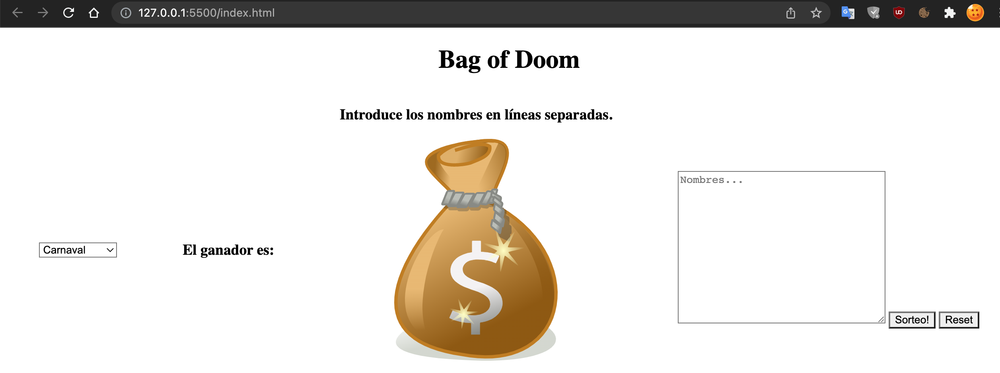

# BAG of DOOM

Design a web to choose a random value by the user.

## Starting 🚀

- Open VS Code.
- Push Clone Git Repository.
- Paste https://github.com/checkmyprojects/wheel-of-doom.
- Enjoy.

See **Deployment** to learn how to deploy the project.

### Requeriments 📋

- VS Code.
- Browser.

### Installation 🔧

- Git clone https://github.com/checkmyprojects/wheel-of-doom.
- Click on Run - Start debugging.
- Enjoy.

### Coding style tests ⌨️

Verifies the proper functioning of the web with the technologies applied to it.

## Made it 🛠️

* [Trello](https://trello.com/b/LAXZpvTz/123-coders) - Project Organization.
* [Balsamiq](https://balsamiq.cloud/s5tauor/p75s6vf/rDB97) - 
* [Logoist 4](https://www.syniumsoftware.com/logoist) - Logo & Favicon design.
* [Figma](https://www.figma.com/file/uDFYrQYkMYordGhM3zFO60/Wheel-of-doom) - The web framework used.
* [HTML & CSS] - HTML for the creation of the web page and CSS to style it.
* [JAVASCRIPT] - To give animations to the web.
* [GIT & GITHUB] - Keeping track of changes in computer files including coordinating team work.
* [Ilustrator] - Images editing.

## Versions 📌

For all available versions, see the [tags in this repository](https://github.com/checkmyprojects/wheel-of-doom.git).

## Autors ✒️

Francisco Domínguez 
Glaucia Meire
Jesús Vázquez
Yessica Pérez
Raquel Castro

## Licency 📄

This project is licensed under the (123 Coders!) License - see the file [LICENSE.md](LICENSE.md) for details.

## Thanks 🎁

* Tell others about this project 📢
* Invite someone from the team a beer 🍺 or a coffee ☕. If you are very grateful, an Audi or BMW 🚗 we accept it too.
* Give thanks publicly 🤓.
* etc.

---
